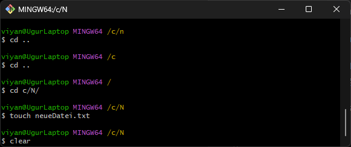

# GIT Bash Terminal





### Was ist Git Bash?  

Git Bash ist eine Befehlszeilenumgebung für Windows, die eine Unix-ähnliche Shell bereitstellt und speziell für die Arbeit mit Git entwickelt wurde. Sie vereinfacht das Ausführen von Git-Befehlen und bietet Unix-Tools wie `ls`, `rm` und `cd`.

---

### **Wichtige Funktionen**  

1. **Unix-ähnliche Umgebung**  
   - Nutzung bekannter Befehle aus Unix/Linux:  
     ```bash
     ls    # Listet Dateien im aktuellen Verzeichnis auf
     md    # Erstellt einen Verzeichnis
     cd    # Wechselt das Verzeichnis
     rm    # Löscht eine Datei oder ein Verzeichnis
     clear # Bildschierm löschen
     ```
   
2. **Git-Integration**  
   - Git-Befehle direkt ausführen:  
     ```bash
     git init      # Neues Git-Repository erstellen
     git .         # Änderungen übernehmen (in Stagig-Area hinzufügen)
     git commit -m "Initialer Commit"  # Änderungen speichern
     git push origin main  # Änderungen in ein Remote-Repository hochladen
     ```

---

### **Typische Anwendungen**

- **Git-Repositories verwalten**  
  Beispiel: Ein neues Projekt klonen und den Status prüfen.  
  ```bash
  git clone https://github.com/Benutzername/Projekt.git
  cd Projekt
  git status
  ```

- **Dateien und Verzeichnisse bearbeiten**  
  Beispiel: Eine Datei erstellen und löschen.  
  ```bash
  touch neueDatei.txt
  rm neueDatei.txt
  ```

---

Git Bash kombiniert die Stärken von Git und Unix-Tools und ist ideal für Entwickler, die eine flexible Umgebung auf Windows benötigen.

